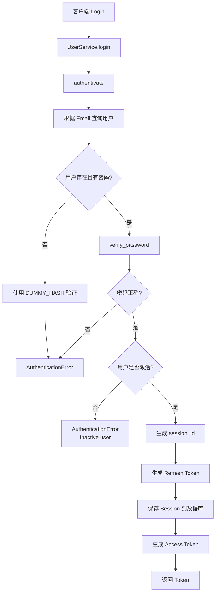

# UserService 流程图



## 说明

这是 `UserService` 的核心业务流程，覆盖了：

- 注册、创建、更新、删除
- 登录、刷新 token、退出登录
- 修改密码
- 密码找回与重置
- 会话失效与安全回收

它严格遵循“服务层处理业务规则，repository 负责数据访问”的结构。
```

## 说明

这是 `UserService` 的核心业务流程，覆盖了：

- 注册、创建、更新、删除
- 登录、刷新 token、退出登录
- 修改密码
- 密码找回与重置
- 会话失效与安全回收

它严格遵循“服务层处理业务规则，repository 负责数据访问”的结构。
